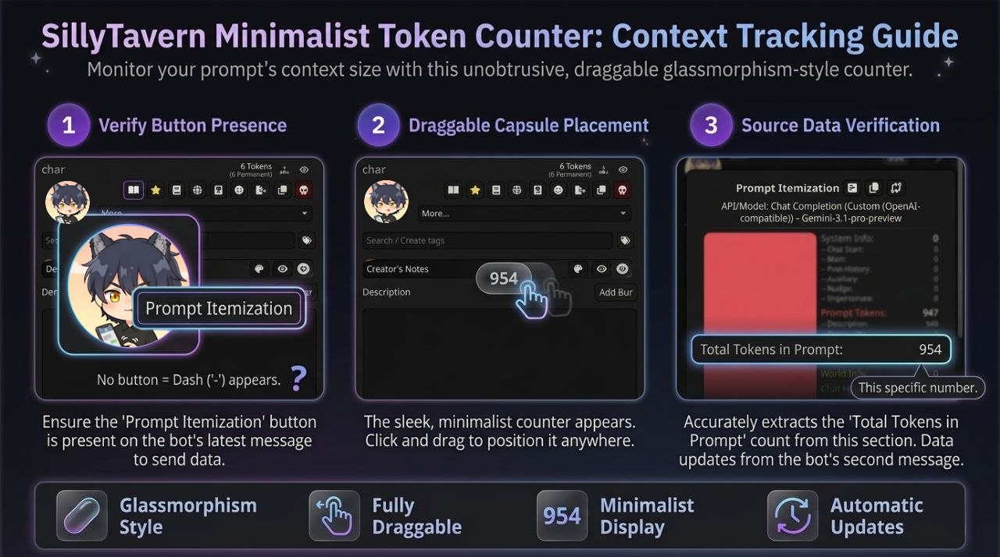

# Tokens Count

  

## Eng ReadMe

### About

Updated! Now more accurate. It takes the number of tokens from the Prompt Itemization section, specifically from Total Tokens in Prompt.
The most minimalistic token counter for SillyTavern (from those I saw). Shows only one number, the number of tokens consumed in the chat context.

### Features

- A small semi-transparent rounded capsule in a glassmorphism style, unobtrusive and easy to move around
- Minimalism, no extra elements, just the counter
- Draggable in any section of SillyTavern
- If a dash appears in the capsule, check the bot's most recent message to ensure the Prompt Itemization button is present; when it is present, the number of tokens spent is transmitted starting from the bot’s second message in the chat

### Installation

Copy the repository link and add the extension via the SillyTavern extensions menu.

### Contacts

My Telegram-channel: [@sillytavern1](https://t.me/sillytavern1)

### Credits

This extension is based on Chat-Tracker-ST by SunKatz05:
https://github.com/SunKatz05/Chat-Tracker-ST

## Прочти меня

### О расширении

Обновлено! Теперь работает точнее. Берёт число токенов из раздела Prompt Itemization, а именно из Total Tokens in Prompt.
Самый минималистичный счётчик токенов (из встреченных мной) для SillyTavern. Показывает только одно число, количество токенов, потраченных вами.

### Особенности

- Маленькая и полупрозрачная скруглённая капсула в стиле глассморфизм, не отвлекает, легко перемещается
- Минимализм, никаких прочих элементов, только потраченные токены
- Перетаскивание в любом разделе SillyTavern
- Если у вас отображается прочерк в капсуле, проверьте последнее сообщение от бота, что кнопка Prompt Itemization есть; когда она есть, то передаётся число потраченных токенов начиная со 2 сообщения бота в чате

### Установка

Скопируйте ссылку на репозиторий и добавьте расширение через меню расширений SillyTavern.

### Контакты

Мой Телеграм-канал: [@sillytavern1](https://t.me/sillytavern1)

### Кредиты

Расширение изначально базировалось на Chat-Tracker-ST от SunKatz05: 
https://github.com/SunKatz05/Chat-Tracker-ST
